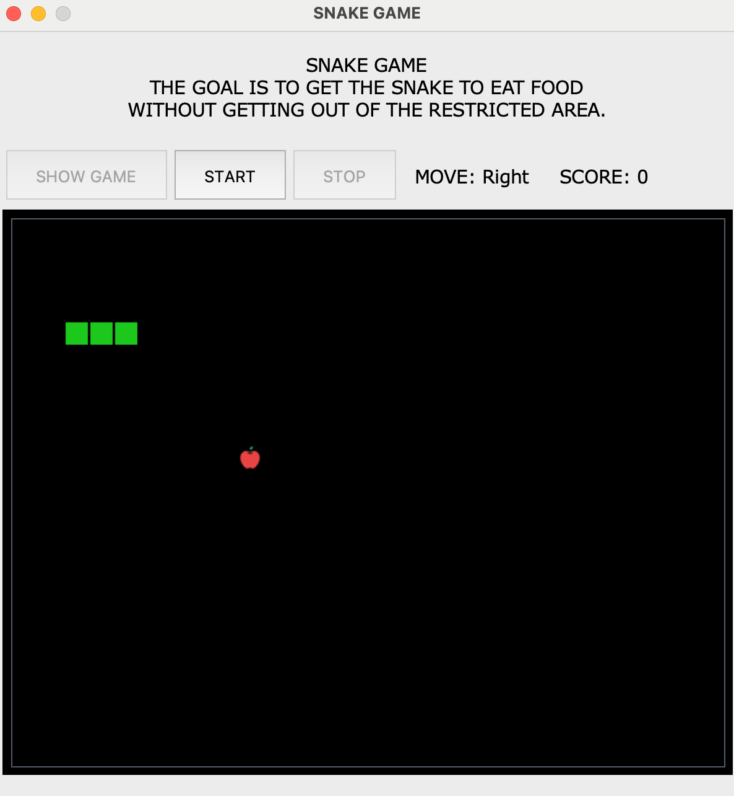

# py-frolics
GAME NIGHTS - Playful activities written by ground-ups and for kids

## Configurations

1. Clone the [py-frolics](https://github.com/baboyma/py-frolics)
2. python -m venv .venv
3. source .venv/bin/activate
4. pip install -U pip
5. pip install poetry
6. poetry shell
7. poetry install

## How to run this

`poetry run python -m frolics -g snake`

`-g` can be replaced with `--game` and is used to pass the name of the game to be executed.

## Have ideas?

Create an issue or reach out.

## HAPPY GAMING!